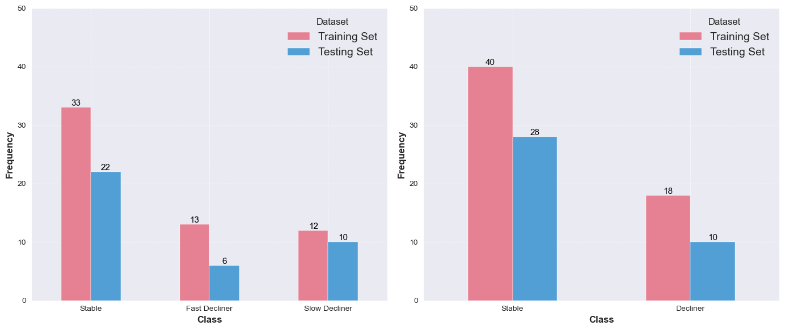

# Prediction of Cognitive Decline Trajectories on Multi-Omics Data

## Table of Contents
- [Introduction](#introduction)
- [Project Structure](#project-structure)
- [Installation](#installation)

### Introduction

In this project, I evaluated various methodologies
for predicting cognitive decline trajectories
using multi-omics data from the **Alzheimer's Disease Neuroimaging Initiative (ADNI)**.

The classification of cognitive decline trajectories developed by _Laroche et al._ 
is used as the target variable for the predictive modeling tasks
The classification includes three classes: _Stable_, _Slow Decliner_, _Fast Decliner_
or a binary classification task with _Stable_ and _Decliner_ classes.




I tested various feature selection techniques as a preprocessing step before predictive modeling, including:
- **Boruta method**
- **Recursive Feature Elimination**
- **Mutual Information Feature Selection**
- **Anova F-Value Feature Selection**

Furthermore, I tested various machine learning models for binary and multiclass classification tasks.
This includes:
- **Logistic Regression with L1 regularization**
- **Random Forest**
- **(s)PLS-DA**
- **AdaBoost**
- **DIABLO**

### Project Structure

```plaintext
├── binary_classification   # Includes model testing and biomarker selection methods
│   └──  models             # Models used in the binary classification task
│ 
├── data                    # Data used in the project and R files for dataset creation
│ 
├── insignificant           # Adjusted boruta and lazy_classifier methods due to version incompatibility
│ 
├── methods                 # Helper and feature selection methods used in the project
│
├── multiclassification     # Models used in the multiclassification task
│   
├── preliminary             # EDAs and preliminary analysis including PCA
│ 
├── results                 # Text files including results of the models and biomarker analysis
│   └──  images             # Images used for plotting
│ 
└── README.md               # Project README
```

### Installation

**Python Dependencies**

Install the required Python packages using pip:

```bash
# Clone the repository
git clone https://github.com/mmmmaja/ThesisFinal.git

# Install required packages
pip install -r requirements.txt
```

**R Dependencies
Make sure you have R installed on your system.**
Install the required R packages using the following commands in an R console:
    
```R
install.packages(c("readxl", "dplyr", "mixOmics", "reshape2"))
```